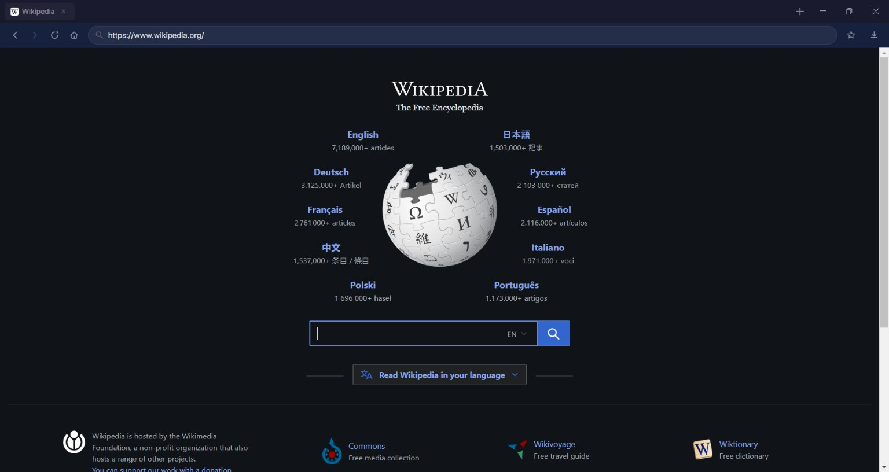
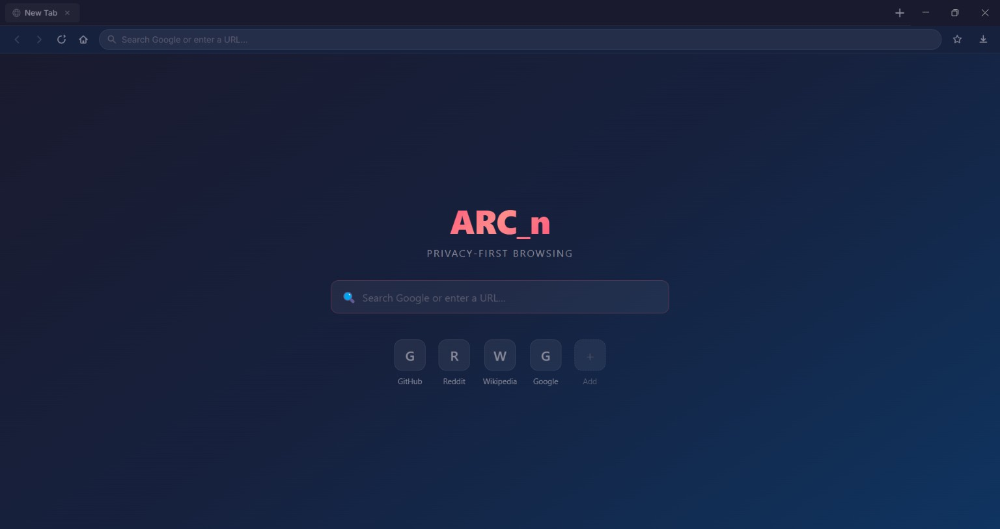
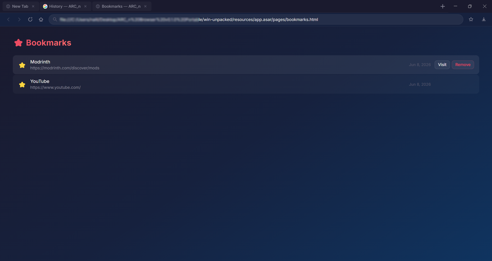
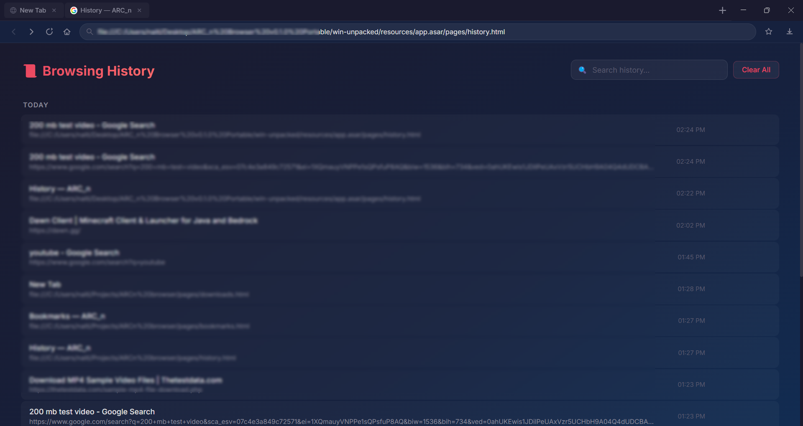

# ARC_n Browser

> A modern, lightweight, privacy-focused desktop browser built with Electron.

ARC_n Browser is an experimental next-generation desktop browser focused on speed, simplicity, customization, and modern web technologies. Built using Electron's modern `WebContentsView` architecture, ARC_n aims to provide a clean browsing experience while remaining highly customizable and developer-friendly.

---

## 📊 Project Status

Current Version: **v0.1.0 Alpha**

Status: 🚧 Active Development

Latest Milestone:
- ✅ Core Browser Experience Complete
- 🚧 Browser Polish & Stability Improvements

---

## ✨ Features

### Current Features

* 🗂️ Multi-tab browsing
* 🌐 Modern WebContentsView architecture
* 🛡️ Integrated ad blocking
* ⭐ Bookmarks system
* 📜 Browsing history
* ⬇️ Download manager
* 🏠 Dynamic start page
* 🎨 Clean dark-themed interface
* 🔒 Secure Electron configuration
* ⚡ Fast tab switching
* 📍 Smart address bar navigation
* 💾 Persistent local storage

---

## 🗺️ Development Roadmap

### Browser Experience

* [x] Favicons
* [x] Bookmarks System
* [x] Browsing History
* [x] Download Manager
* [x] Dynamic Start Page

### Productivity

* [ ] Keyboard Shortcuts
* [ ] Recently Closed Tabs
* [ ] Search Suggestions
* [ ] Find in Page
* [ ] Reader Mode

### Performance

* [ ] Tab Snoozing
* [ ] Lazy Tab Loading
* [ ] Crash Recovery
* [ ] Performance Dashboard

### Privacy

* [ ] Privacy Dashboard
* [ ] Enhanced Tracker Blocking
* [ ] Site Permission Controls

### Customization

* [ ] Theme Engine
* [ ] Workspace Profiles
* [ ] Settings Center

---

📌 For the complete development roadmap, planned features, release goals, and project progress, see:

➡️ [roadmap.md](roadmap.md)

---

## 📸 Screenshots

### Main Browser Window



### Start Page



### Bookmarks



### History



### Download Manager

> Screenshots will be added as development progresses.

---

## 🏗️ Technology Stack

ARC_n Browser is built using:

| Technology         | Purpose                       |
| ------------------ | ----------------------------- |
| Electron           | Desktop Application Framework |
| Node.js            | Runtime Environment           |
| HTML               | User Interface Structure      |
| CSS                | Styling & Layout              |
| JavaScript         | Browser Logic                 |
| WebContentsView    | Modern Tab Rendering          |
| Ghostery Adblocker | Content Blocking              |

---

## 📁 Project Structure

```text
ARC_n-Browser/
│
├── managers/
│   ├── BookmarkManager.js
│   ├── HistoryManager.js
│   ├── DownloadManager.js
│   └── ShortcutManager.js
│
├── pages/
│   ├── bookmarks.html
│   └── history.html
│
├── main.js
├── preload.js
├── renderer.js
├── index.html
├── styles.css
│
├── ROADMAP.md
├── README.md
├── package.json
└── .gitignore
```

### Core Files

#### main.js

Main Electron process.

Responsible for:

* Window management
* Tab management
* Browser views
* Navigation control
* IPC communication

---

#### preload.js

Secure bridge between renderer and main process.

Responsible for:

* Exposing browser APIs
* IPC communication
* Security isolation

---

#### renderer.js

Frontend application logic.

Responsible for:

* Tab rendering
* Address bar
* Browser controls
* UI updates

---

#### styles.css

Visual styling and theme system.

---

#### index.html

Application shell and layout.

---

## ⚡ Installation

### Clone Repository

```bash
git clone https://github.com/ARCns09/ARC_n-Browser.git
cd ARC_n-Browser
```

### Install Dependencies

```bash
npm install
```

### Start Development Build

```bash
npm start
```

---

## 🛡️ Security

ARC_n follows modern Electron security recommendations:

* Context Isolation Enabled
* Context Bridge API
* No Deprecated WebViews
* IPC Separation
* Secure Renderer Communication

Future releases will continue improving privacy and security features.

---

## 🎯 Project Goals

ARC_n aims to become:

* Lightweight
* Fast
* Privacy-focused
* Highly customizable
* Developer-friendly
* Modern and clean

The project prioritizes simplicity and performance over unnecessary complexity.

---

## 🗺️ Long-Term Vision

Future releases may include:

* Account Sync
* Workspace System
* Vertical Tabs
* Split Views
* Theme Marketplace
* Extension Support
* Privacy Reports
* Session Management
* Advanced Download Tools

---

## 🤝 Contributing

Contributions, suggestions, bug reports, and feature requests are welcome.

If you'd like to contribute:

1. Fork the repository
2. Create a feature branch
3. Commit your changes
4. Open a pull request

---

## 🐛 Reporting Issues

Found a bug?

Please open an issue with:

* Expected behavior
* Actual behavior
* Steps to reproduce
* Screenshots (if applicable)

---

## 📜 License

Licensed under the MIT License.

---

## ❤️ Credits

Built by **ARCns09**

Powered by:

* Electron
* Node.js
* Open Source Software

---

### ARC_n Browser

**Browse fast. Stay focused. Build your web your way.**
